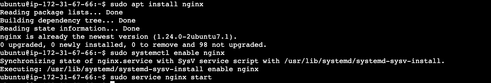

  <h3 align="center">Laravel Setup over AWS</h3>
  

    Assignment Result URL = https://bhrtest.coid.io/
     
     
  

# Table of Contents

1. [EC2 Setup](#ec2-setup)
2. [RDS Setup](#rds-setup)
3. [Laravel Deployment](#laravel-deployment)
    - 3.1 [Nginx Setup](#nginx-setup)
    - 3.2 [PHP and PHP-FPM Setup](#php-and-php-fpm-setup)
    - 3.3 [Install Composer and Laravel Setup](#install-composer-and-laravel-setup)
4. [Domain Setup and SSL Deployment](#domain-setup-and-ssl-deployment)

## EC2 Setup

- create ec2 from aws console

- attach elastic ip to ec2

## RDS Setup

- create Aurora Mysql RDS from aws console

- Allow EC2 security group to RDS Access

- Test DB Connection and create database

## Laravel Deployment

### Nginx Setup
- connect EC2 with ssh and install nginx

- check nginx default page

### PHP and PHP-FPM Setup
- install php , php-fpm and php extensions

### Install Composer and Laravel Setup

- install composer and create laravel project with composer

- Update database credentials in .env file
- Database migration

- Nginx Config for Laravel

- Web Serice User Permission for laravel storage

## Domain Setup and SSL Deployment

- add dns record

- install certbot for free ssl

- add domain name in nginx config 

- generate ssl with certbot cli

- Final Result

